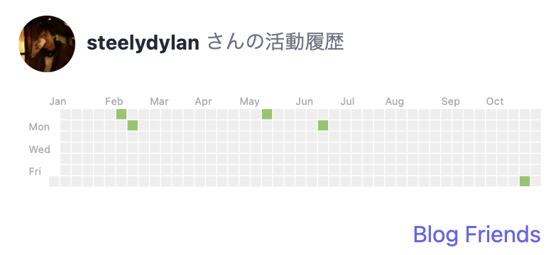

# Blog Friends Embed

[Blog Friends](https://blog-friends.com) のサービス利用者が、自身のブログの活動履歴をサイトに埋め込むためのスクリプトです。


## Screenshot


## How to Use

embed following scripts

```html
<a href="#" class="js-blog-friends" data-user="steelydylan">steelydylan</a>
<script async src="https://unpkg.com/blog-friends-embed@1.0.0/widgets.js" charset="utf-8"></script>
```
